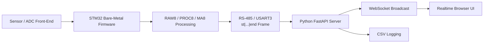

<h1>Realtime Sensor Platform - STM32 Bare-Metal Porting</h1>

  FPGA/ZedBoard 기반으로 구현했던
  <a href="https://github.com/DO-MADO/Realtime-Sensor-Platform">Realtime Sensor Platform</a>을
  소형 임베디드 보드에서 운용하기 위해 STM32 베어메탈 환경으로 리팩토링 및 이식한 프로젝트입니다.

  
  
  
  

 

<h2>프로젝트 개요</h2>

<table>
  <tr>
    <th width="180">구분</th>
    <th>내용</th>
  </tr>
  <tr>
    <td><b>원본 프로젝트</b></td>
    <td>FPGA/ZedBoard 환경에서 실시간 센서 데이터 수집, 신호 처리, PC 시각화를 수행한 플랫폼</td>
  </tr>
  <tr>
    <td><b>이식 목표</b></td>
    <td>시스템 소형화를 위해 기존 기능을 STM32 기반 베어메탈 펌웨어로 재구성</td>
  </tr>
  <tr>
    <td><b>핵심 작업</b></td>
    <td>센서 데이터 수집, 필터링, 이동평균, 보정 계수 적용, 온도 데이터 처리, PC 연동 프로토콜 재설계</td>
  </tr>
  <tr>
    <td><b>PC 연동</b></td>
    <td>RS-485/USART3 텍스트 프레임을 FastAPI 서버에서 수신하고 WebSocket으로 브라우저 UI에 실시간 브로드캐스트</td>
  </tr>
</table>

<h2>왜 STM32로 옮겼는가</h2>

<table>
  <tr>
    <th>FPGA/ZedBoard 기반</th>
    <th>STM32 베어메탈 기반</th>
  </tr>
  <tr>
    <td>고성능 검증 및 알고리즘 프로토타입에 적합</td>
    <td>소형화, 저전력화, 독립 동작 장치화에 적합</td>
  </tr>
  <tr>
    <td>Linux/libiio 기반 데이터 경로 사용</td>
    <td>HAL + 인터럽트 + 메인 루프 기반 직접 제어</td>
  </tr>
  <tr>
    <td>보드/주변 구성 규모가 큼</td>
    <td>PCB 내장형 제어 구조로 확장 가능</td>
  </tr>
</table>

<h2>시스템 구조</h2>

<h2>주요 구현 내용</h2>

<table>
  <tr>
    <th width="220">영역</th>
    <th>구현 내용</th>
  </tr>
  <tr>
    <td><b>STM32 펌웨어</b></td>
    <td>
      STM32H7 HAL 초기화, SPI/I2C/FMC/TIM/USART 주변장치 구성,
      AD 샘플 취득 루프, USART3 인터럽트 수신, RS-485 송신 방향 제어를 구현했습니다.
    </td>
  </tr>
  <tr>
    <td><b>실시간 신호 처리</b></td>
    <td>
      8채널 RAW 데이터에 대해 gain/offset 보정, 1차 IIR LPF, 이동평균(MA)을 적용하고
      RAW8, PROC8, MA8 블록으로 분리해 PC로 전송합니다.
    </td>
  </tr>
  <tr>
    <td><b>설정 프레임 파서</b></td>
    <td>
      PC에서 전달한 <code>st|...|end</code> 설정 프레임을 파싱하여
      LPF 컷오프, 샘플링 레이트, 평균 창 크기, 플래그, 채널별 계수를 런타임에 반영합니다.
    </td>
  </tr>
  <tr>
    <td><b>온도 처리</b></td>
    <td>
      ADS1115/NTC 기반 온도 측정 경로를 고려해 현재 온도를 데이터 프레임에 포함하도록 구성했습니다.
    </td>
  </tr>
  <tr>
    <td><b>PC 서버/UI</b></td>
    <td>
      FastAPI 서버가 시리얼 프레임을 수신하고, 파이프라인에서 스테이지별 데이터로 분리한 뒤
      WebSocket을 통해 브라우저 그래프 UI로 전달합니다.
    </td>
  </tr>
</table>

<h2>데이터 흐름</h2>

<pre>
PC Configuration
  st|lpf|fs|range|decim|avg|flags|baud|b[8]|a[8]|gain[8]|offset[8]|end

STM32 Processing
  RAW8 -> gain/offset -> IIR LPF -> Moving Average -> temperature append

STM32 to PC
  st|sid|timestamp_ms|sampling_rate|nsamp|status|RAW8|PROC8|MA8|nsamp|status|tempC|end
</pre>

<h2>Repository Layout</h2>

<table>
  <tr>
    <th width="240">Path</th>
    <th>Description</th>
  </tr>
  <tr>
    <td><code>stm32/Src/main.c</code></td>
    <td>STM32 메인 펌웨어 로직, 설정 프레임 파서, 데이터 처리 및 RS-485 송신</td>
  </tr>
  <tr>
    <td><code>stm32/Src/*.c</code></td>
    <td>CubeMX/HAL 기반 GPIO, SPI, I2C, UART, TIM, FMC 초기화 코드</td>
  </tr>
  <tr>
    <td><code>stm32/server/app.py</code></td>
    <td>FastAPI REST/WebSocket 서버 및 UI 엔드포인트</td>
  </tr>
  <tr>
    <td><code>stm32/server/pipeline.py</code></td>
    <td>C/ZedBoard, Synthetic, Serial 소스를 공통 파이프라인으로 추상화</td>
  </tr>
  <tr>
    <td><code>stm32/server/serial_io.py</code></td>
    <td>RS-485/RS-232 텍스트 프레임 인코딩, 디코딩, 시리얼 입출력</td>
  </tr>
  <tr>
    <td><code>stm32/server/static/</code></td>
    <td>실시간 그래프, 설정 탭, 온도 모니터링을 제공하는 웹 UI</td>
  </tr>
  <tr>
    <td><code>logs/</code></td>
    <td>실험 및 수집 데이터 CSV 로그</td>
  </tr>
</table>

<h2>Tech Stack</h2>

<table>
  <tr>
    <th>Layer</th>
    <th>Stack</th>
  </tr>
  <tr>
    <td>Firmware</td>
    <td>C, STM32 HAL, Bare-Metal Loop, UART Interrupt, RS-485</td>
  </tr>
  <tr>
    <td>Signal Processing</td>
    <td>8ch RAW acquisition, IIR LPF, Moving Average, Gain/Offset Calibration</td>
  </tr>
  <tr>
    <td>Server</td>
    <td>Python, FastAPI, WebSocket, PySerial, NumPy, Pandas</td>
  </tr>
  <tr>
    <td>Frontend</td>
    <td>HTML, CSS, JavaScript, realtime chart UI</td>
  </tr>
</table>

<h2>현재 상태</h2>

<ul>
  <li>STM32 펌웨어 기준 데이터 취득/처리/전송 루프 구성</li>
  <li>PC → STM32 설정 프레임 및 STM32 → PC 데이터 프레임 설계</li>
  <li>FastAPI 기반 실시간 모니터링 서버 및 브라우저 UI 구성</li>
  <li>Synthetic 모드와 Serial 모드를 분리하여 하드웨어 없이도 UI/서버 검증 가능</li>
  <li>CSV 저장 기능을 통해 실험 로그 확보 가능</li>
</ul>

<h2>프로젝트 의의</h2>

  이 프로젝트는 FPGA/ZedBoard에서 검증한 실시간 센서 처리 구조를
  STM32 베어메탈 환경으로 이식하면서, 임베디드 펌웨어와 PC 기반 실시간 시각화 시스템을
  하나의 흐름으로 재구성한 작업입니다.

  단순 코드 변환이 아니라 보드 변경에 맞춰 데이터 취득 방식, 런타임 설정 프로토콜,
  필터/보정 처리 위치, PC UI 연동 방식을 다시 설계한 리팩토링 프로젝트입니다.

